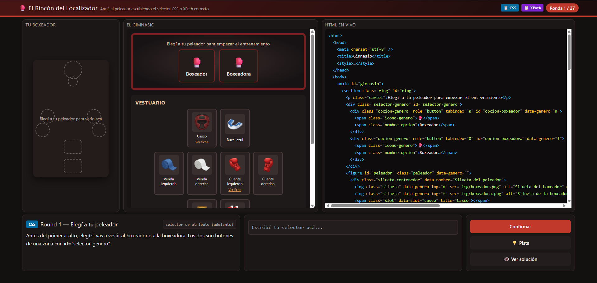

# El Rincón del Localizador

Juego interactivo para practicar selectores **CSS** y **XPath**: hay que ir vistiendo a un peleador de boxeo escribiendo, en cada round, el selector correcto que apunta al elemento pedido dentro de un DOM de práctica.

Recorre, ronda por ronda, las técnicas de las tablas de referencia de CSS y XPath (también consultables desde los botones del header).

## Cómo abrirlo

Abrí `index.html` en el navegador (doble clic alcanza, no necesita servidor).

## Home

